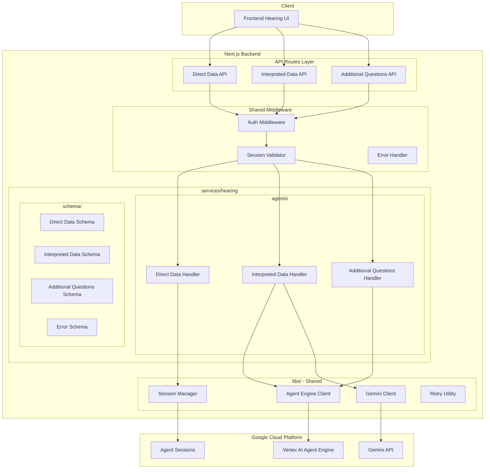
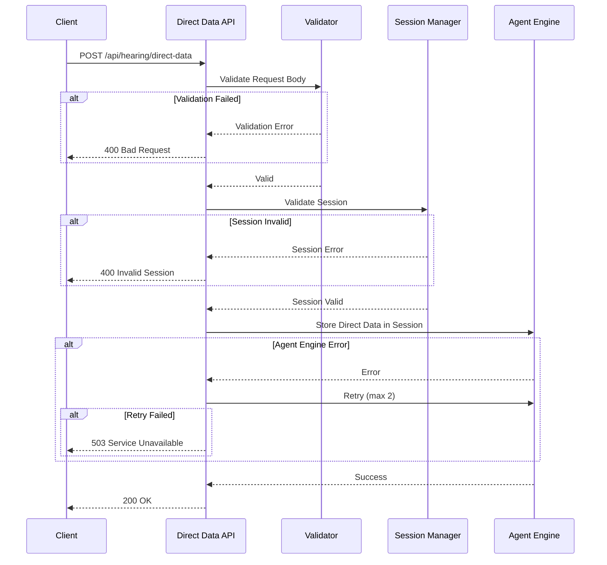
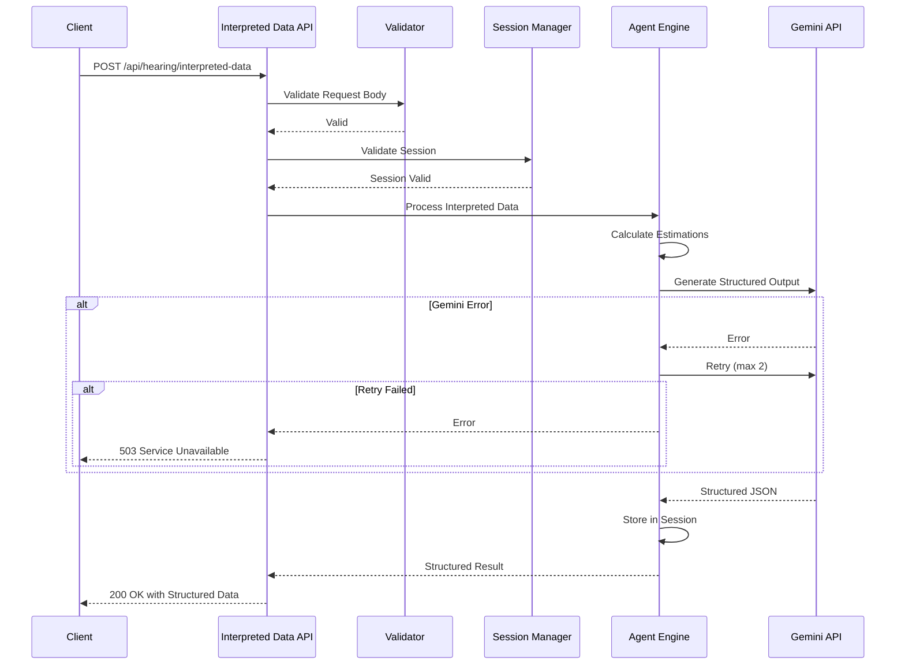
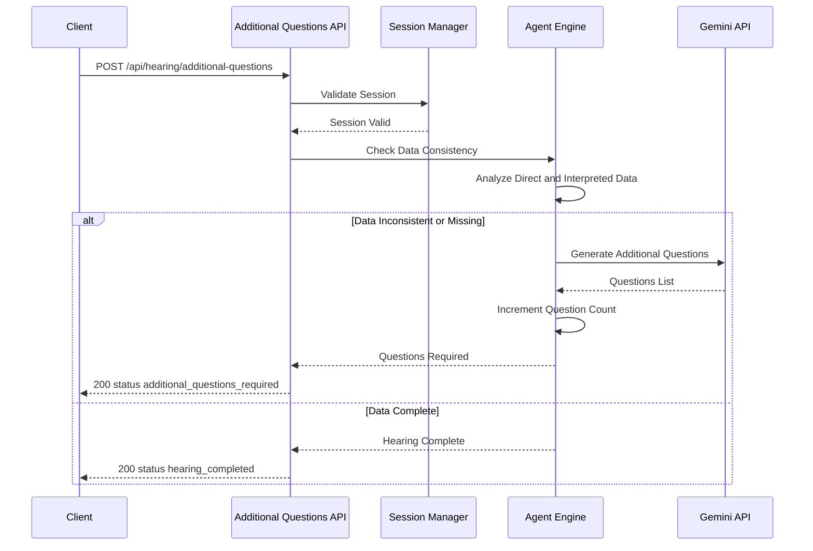
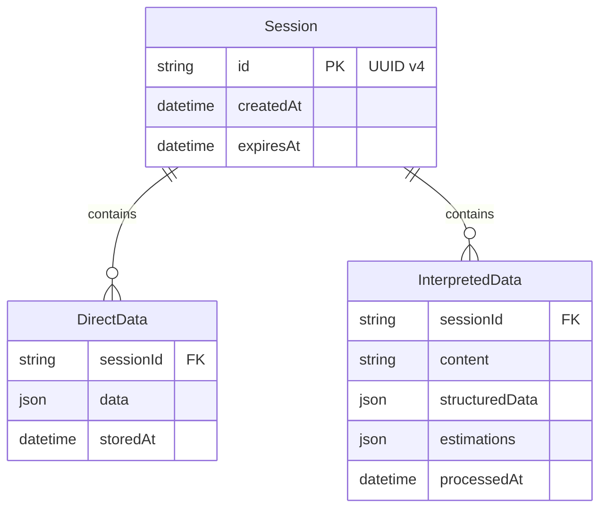

# Technical Design: Hearing API

## Overview

**Purpose**: Life Compass のヒアリングフェーズにおいて、ユーザーの財務データを段階的に収集・構造化するための3つの API エンドポイントを提供する。

**Users**: フロントエンド（ヒアリング UI）がこれらの API を呼び出し、ユーザーの入力を処理する。

**Impact**: 既存の `/api/agent/query` エンドポイントを補完し、より細分化されたデータ収集フローを実現する。

### Goals
- 直接データ（AI 解釈不要）とAI 解釈データを明確に分離した API 設計
- セッション管理による継続的なヒアリング体験の提供
- 構造化出力スキーマの動的指定による柔軟な AI 解釈
- 自動リトライとエラーハンドリングによる信頼性の確保

### Non-Goals
- ヒアリング UI の実装（フロントエンド側の責務）
- ヒアリング JSON の永続化（Firestore 保存は別フェーズ）
- ライフプラン表の生成（別 API スコープ）
- 認証基盤の新規構築（既存 Firebase Authentication を使用）
- DB アクセス（セッションデータは Agent Engine Sessions に保存）
- ユーザー ID とセッション ID の紐付け管理

### Key Assumptions
- **匿名認証**: Firebase Authentication Anonymous Auth を使用（ログイン不要）
- **セッション独立**: セッション ID はユーザー ID に紐付けない（匿名ユーザーのため）

## Architecture

### Existing Architecture Analysis

現在の `/api/agent/query` エンドポイントは以下のパターンで実装されている：

```
Client → API Route → fpInstructor (Agent Engine) → jsonEditor (Gemini) → Response
```

このパターンを踏襲しつつ、以下の点を改善する：
- エンドポイントを機能別に分離（直接データ / 解釈データ / 追加質問）
- 構造化エラーレスポンスの導入
- リトライロジックの追加
- セッション検証の強化

### Architecture Pattern & Boundary Map



**Architecture Integration**:
- Selected pattern: Service-based Colocation（モジュラモノリス） + レイヤードアーキテクチャ
- Domain boundaries: API Routes → services/hearing/{agents, schema} → libs/ の依存方向
- Colocation benefits: hearing 機能に関連するコードが `services/hearing/` に集約され、変更影響範囲が明確
- Existing patterns preserved: `@/*` パスエイリアス、Zod バリデーション、Agent Engine 統合
- New components rationale: 各 API に専用の Handler と Schema を設け、同一サービス配下にコロケーション
- Steering compliance: tech.md のレイヤー分離原則に準拠

**Handler/Route 責務分離**:
- Handler: ビジネスロジックのみを担当。NextResponse を返さず、純粋なデータ/エラーオブジェクトを返す
- route.ts: リクエスト検証、Handler 呼び出し、レスポンス検証、NextResponse 生成を担当
- この分離により、Handler のテスト容易性と再利用性が向上

### Technology Stack

| Layer | Choice / Version | Role in Feature | Notes |
|-------|------------------|-----------------|-------|
| Backend | Next.js 16.1.1 (App Router) | API Routes による REST エンドポイント提供 | 既存と同一 |
| Runtime | Node.js 24.12.0 | サーバーサイド実行環境 | 既存と同一 |
| Validation | Zod 4.x | リクエスト/レスポンスのスキーマ検証 | 既存と同一 |
| AI Integration | @google/genai | Gemini API 構造化出力 | 既存と同一 |
| AI Platform | Vertex AI Agent Engine | セッション管理、AI エージェント実行 | 既存と同一 |
| Authentication | Firebase Authentication | ユーザー認証トークン検証 | 既存と同一 |

## System Flows

### 直接データ受信フロー



### 解釈データ受信フロー



### 追加質問判定フロー



**Key Decisions**:
- 直接データは Agent Engine Sessions に保存のみ（AI 処理なし）
- 解釈データは Agent Engine で推定後、Gemini で構造化
- 追加質問は最大3回までループ可能、超過時は強制完了

## Requirements Traceability

| Requirement | Summary | Components | Interfaces | Flows |
|-------------|---------|------------|------------|-------|
| 1.1-1.7 | 直接データ受信 | DirectDataHandler, SessionManager | DirectDataAPI | 直接データ受信フロー |
| 2.1-2.10 | 解釈データ受信 | InterpretedDataHandler, GeminiClient | InterpretedDataAPI | 解釈データ受信フロー |
| 3.1-3.10 | 追加質問判定 | AdditionalQuestionsHandler | AdditionalQuestionsAPI | 追加質問判定フロー |
| 4.1-4.5 | セッション管理 | SessionManager | 全 API 共通 | 全フロー |
| 5.1-5.5 | エラーハンドリング | ErrorHandler | ErrorSchema | 全フロー（エラー時） |
| 6.1-6.5 | データバリデーション | RequestValidator, Zod Schemas | 全 API 共通 | 全フロー |
| 7.1-7.4 | パフォーマンス | RetryUtility | - | 全フロー |
| 8.1-8.4 | セキュリティ | AuthMiddleware | - | 全フロー |

## Components and Interfaces

### Component Summary

| Component | Domain/Layer | Intent | Req Coverage | Key Dependencies | Contracts |
|-----------|--------------|--------|--------------|------------------|-----------|
| DirectDataRoute | API Routes | 直接データ受信エンドポイント | 1.1-1.7 | SessionManager (P0) | API |
| InterpretedDataRoute | API Routes | 解釈データ受信エンドポイント | 2.1-2.10 | AgentEngineClient (P0), GeminiClient (P0) | API |
| AdditionalQuestionsRoute | API Routes | 追加質問判定エンドポイント | 3.1-3.10 | AgentEngineClient (P0) | API |
| SessionManager | Libs/Google | セッション検証・管理 | 4.1-4.5 | Agent Engine Sessions (External) | Service |
| AgentEngineClient | Libs/Google | Agent Engine 通信 | 2.2-2.5, 3.2-3.5 | Vertex AI (External) | Service |
| GeminiClient | Libs/Google | Gemini API 構造化出力 | 2.3-2.6 | Gemini API (External) | Service |
| RetryUtility | Libs/Common | リトライロジック | 1.5-1.6, 2.7-2.8, 3.9-3.10 | - | Service |
| AuthMiddleware | Middleware | Firebase 認証検証 | 8.1-8.3 | Firebase Auth (External) | Service |
| RequestValidator | Schema | Zod バリデーション | 6.1-6.5 | Zod | Service |

---

### API Routes Layer

#### DirectDataRoute

| Field | Detail |
|-------|--------|
| Intent | 直接データ（AI 解釈不要）を受信しセッションに保存 |
| Requirements | 1.1, 1.2, 1.3, 1.4, 1.5, 1.6, 1.7 |

**Responsibilities & Constraints**
- リクエストボディの Zod バリデーション
- セッション ID の検証（存在確認、有効期限）
- Agent Engine Sessions への直接データ保存
- エラー時のリトライ（最大2回）
- Handler 戻り値のレスポンス検証と NextResponse 生成

**Dependencies**
- Inbound: Frontend — API 呼び出し (P0)
- Outbound: SessionManager — セッション検証・保存 (P0)
- External: Firebase Auth — 認証トークン検証 (P0)

**Contracts**: API [x]

##### API Contract

| Method | Endpoint | Request | Response | Errors |
|--------|----------|---------|----------|--------|
| POST | /api/hearing/direct-data | DirectDataRequest | DirectDataResponse | 400, 401, 403, 503 |

```typescript
// Request Schema
interface DirectDataRequest {
  sessionId?: string;           // UUID v4（省略時は新規作成）
  data: {
    [key: string]: unknown;     // 任意のキー・バリュー形式
  };
}

// Response Schema
interface DirectDataResponse {
  success: true;
  sessionId: string;            // UUID v4
  storedAt: string;             // ISO 8601 timestamp
}
```

---

#### InterpretedDataRoute

| Field | Detail |
|-------|--------|
| Intent | 自由記述データを AI で解釈・構造化して返却 |
| Requirements | 2.1, 2.2, 2.3, 2.4, 2.5, 2.6, 2.7, 2.8, 2.9, 2.10 |

**Responsibilities & Constraints**
- 自由記述テキストの文字数制限バリデーション（最大5000文字）
- 推定対象項目のデフォルト値適用（省略時）
- 必須パラメータ `outputSchema` に基づく Gemini 構造化出力
- 推定結果のセッション保存と返却
- Handler 戻り値のレスポンス検証と NextResponse 生成

**Dependencies**
- Inbound: Frontend — API 呼び出し (P0)
- Outbound: AgentEngineClient — AI 処理 (P0)
- Outbound: GeminiClient — 構造化出力 (P0)
- Outbound: SessionManager — セッション検証 (P0)
- External: Gemini API — LLM 構造化出力 (P0)

**Contracts**: API [x]

##### API Contract

| Method | Endpoint | Request | Response | Errors |
|--------|----------|---------|----------|--------|
| POST | /api/hearing/interpreted-data | InterpretedDataRequest | InterpretedDataResponse | 400, 401, 403, 503 |

```typescript
// Request Schema
interface InterpretedDataRequest {
  sessionId: string;              // UUID v4（必須）
  content: string;                // 自由記述テキスト（最大5000文字）
  estimationTargets?: string[];   // 推定対象項目（省略時はデフォルト）
  outputSchema: JsonSchema;       // アウトプットスキーマ（必須）
}

// JSON Schema 型定義
interface JsonSchema {
  type: "object";
  properties: Record<string, {
    type: string;
    description?: string;
  }>;
  required?: string[];
}

// Response Schema
interface InterpretedDataResponse {
  success: true;
  sessionId: string;
  structuredData: Record<string, unknown>;  // outputSchema 準拠
  estimations: Record<string, Estimation>;
  processedAt: string;            // ISO 8601 timestamp
}

interface Estimation {
  value: number | string;
  reasoning?: string;             // 推定根拠（オプション）
}

// デフォルト推定対象項目
const DEFAULT_ESTIMATION_TARGETS = [
  "inflationRate",
  "incomeGrowthRate",
  "riskTolerance",
  "planningHorizon"
] as const;
```

---

#### AdditionalQuestionsRoute

| Field | Detail |
|-------|--------|
| Intent | データの整合性チェックと追加質問生成 |
| Requirements | 3.1, 3.2, 3.3, 3.4, 3.5, 3.6, 3.7, 3.8, 3.9, 3.10 |

**Responsibilities & Constraints**
- セッション内データの整合性・充足性チェック
- 不足情報に基づく追加質問の生成
- 質問回数のカウント管理（最大3回）
- 最大回数超過時の強制完了
- Handler 戻り値のレスポンス検証と NextResponse 生成

**Dependencies**
- Inbound: Frontend — API 呼び出し (P0)
- Outbound: AgentEngineClient — 整合性チェック・質問生成 (P0)
- Outbound: SessionManager — セッション検証・状態更新 (P0)

**Contracts**: API [x]

##### API Contract

| Method | Endpoint | Request | Response | Errors |
|--------|----------|---------|----------|--------|
| POST | /api/hearing/additional-questions | AdditionalQuestionsRequest | AdditionalQuestionsResponse | 400, 401, 403, 503 |

```typescript
// Request Schema
interface AdditionalQuestionsRequest {
  sessionId: string;              // UUID v4（必須）
  questionCount: number;          // 現在の質問ラウンド数（0〜3、デフォルト0）
}

// 回答数（単一選択 or 複数選択）
type AnswerCount = "single" | "multiple";

// 回答形式
type AnswerFormat =
  | "radio"           // ラジオボタン（単一選択用）
  | "pulldown"        // プルダウン（複数選択用）
  | "numeric"         // 記述式（数字）
  | "short_text"      // 記述式（短文）
  | "long_text";      // 記述式（文章）

// 質問の回答方法定義
interface AnswerMethod {
  answerCount: AnswerCount;       // 回答数: 単一 or 複数
  answerFormat: AnswerFormat;     // 回答形式
  requiresAiInterpretation: boolean;  // AI解釈が必要か（true: 解釈データAPIへ、false: 直接データAPIへ）
  options?: string[];             // 選択肢（radio/pulldown の場合）
}

// 質問型定義
interface Question {
  id: string;                     // 質問ID（UUID v4）
  text: string;                   // 質問文
  answerMethod: AnswerMethod;     // 回答方法
}

// Response Schema（追加質問あり）
interface AdditionalQuestionsRequiredResponse {
  status: "additional_questions_required";
  questions: Question[];
  questionCount: number;          // 現在の質問ラウンド（1-3）
}

// Response Schema（ヒアリング完了）
interface HearingCompletedResponse {
  status: "hearing_completed";
  questionCount: number;
}

type AdditionalQuestionsResponse =
  | AdditionalQuestionsRequiredResponse
  | HearingCompletedResponse;

/**
 * 回答形式と回答先APIの対応表:
 *
 * | 回答数   | 回答形式      | AI解釈 | 回答先API            |
 * |----------|---------------|--------|----------------------|
 * | single   | radio         | false  | direct-data          |
 * | multiple | pulldown      | false  | direct-data          |
 * | single   | numeric       | false  | direct-data          |
 * | single   | short_text    | true   | interpreted-data     |
 * | single   | long_text     | true   | interpreted-data     |
 */
```

---

### Infrastructure Layer

#### SessionManager

| Field | Detail |
|-------|--------|
| Intent | Agent Engine Sessions を使用したセッション管理（既存 `createSessionId.ts` の拡張） |
| Requirements | 4.1, 4.2, 4.3, 4.4, 4.5 |

**役割の説明**:
SessionManager は、Vertex AI Agent Engine の Sessions 機能をラップし、ヒアリング API 全体で使用するセッション管理を一元化するユーティリティです。既存の `createSessionId.ts` を拡張し、セッション検証機能を追加します。追加質問カウントはフロントエンド側で管理します。

**Note**: 匿名認証を使用するため、セッションはユーザー ID に紐付けません。

**Responsibilities & Constraints**
- セッション作成（TTL 10日間、Agent Engine 側で管理）
- セッション検証（存在確認、有効期限）
- セッション状態の更新（直接データ保存、解釈データ保存）
- UUID v4 形式のセッション ID 管理

**Dependencies**
- Inbound: All Handlers — セッション操作 (P0)
- External: Vertex AI Agent Engine Sessions — セッション永続化 (P0)

**Contracts**: Service [x]

##### Service Interface
```typescript
interface SessionManagerService {
  createSession(): Promise<Result<string, SessionError>>;
  validateSession(sessionId: string): Promise<Result<SessionState, SessionError>>;
  updateSessionData(sessionId: string, data: unknown): Promise<Result<void, SessionError>>;
}

interface SessionState {
  id: string;
  createdAt: string;
  expiresAt: string;
}

type SessionError =
  | { code: "SESSION_NOT_FOUND"; message: string }
  | { code: "SESSION_EXPIRED"; message: string }
  | { code: "SESSION_CREATE_FAILED"; message: string };
```

---

#### RetryUtility

| Field | Detail |
|-------|--------|
| Intent | 外部サービス呼び出しのリトライロジック |
| Requirements | 1.5, 1.6, 2.7, 2.8, 3.9, 3.10 |

**Responsibilities & Constraints**
- 指数バックオフによるリトライ（初回1秒、2回目2秒）
- 最大2回のリトライ（計3回試行）
- リトライ回数と待機時間のログ記録

**Dependencies**
- Inbound: All Handlers — リトライ対象処理のラップ (P1)

**Contracts**: Service [x]

##### Service Interface
```typescript
interface RetryOptions {
  maxRetries: number;           // デフォルト: 2
  initialDelayMs: number;       // デフォルト: 1000
  backoffMultiplier: number;    // デフォルト: 2
}

interface RetryUtilityService {
  withRetry<T>(
    operation: () => Promise<T>,
    options?: Partial<RetryOptions>
  ): Promise<Result<T, RetryError>>;
}

type RetryError = {
  code: "MAX_RETRIES_EXCEEDED";
  message: string;
  attempts: number;
  lastError: unknown;
};
```

---

### Data Layer (Schemas)

#### Error Schema

| Field | Detail |
|-------|--------|
| Intent | 統一エラーレスポンス形式 |
| Requirements | 5.1, 5.2, 5.3 |

```typescript
// Zod Schema
const errorResponseSchema = z.object({
  error: z.object({
    id: z.string().uuid(),                    // エラー追跡用 UUID
    code: z.enum([
      "INVALID_REQUEST",
      "VALIDATION_ERROR",
      "INVALID_SESSION",
      "SESSION_EXPIRED",
      "UNAUTHORIZED",
      "AGENT_ERROR",
      "GEMINI_ERROR",
      "SERVICE_UNAVAILABLE",
      "INTERNAL_ERROR"
    ]),
    message: z.string(),                      // ユーザー向けメッセージ
    details: z.unknown().optional(),          // 詳細情報（開発用）
  }),
});

type ErrorResponse = z.infer<typeof errorResponseSchema>;

// HTTP ステータスコードマッピング
const ERROR_STATUS_MAP: Record<string, number> = {
  INVALID_REQUEST: 400,
  VALIDATION_ERROR: 400,
  INVALID_SESSION: 400,
  SESSION_EXPIRED: 400,
  UNAUTHORIZED: 401,
  AGENT_ERROR: 503,
  GEMINI_ERROR: 503,
  SERVICE_UNAVAILABLE: 503,
  INTERNAL_ERROR: 500,
};
```

## Data Models

### Domain Model



**Note**: セッションはユーザー ID に紐付けない（匿名認証のため）。追加質問カウントはフロントエンド側で管理。

**Aggregates**: Session がルートエンティティ、DirectData と InterpretedData は Session に従属

**Invariants**:
- セッション有効期限は作成から10日間
- セッション ID は UUID v4 形式

### Data Contracts & Integration

**API Data Transfer**:
- Request/Response は TypeScript interface で定義
- JSON 形式でシリアライズ
- Zod によるランタイムバリデーション

**Cross-Service Data Management**:
- セッションデータは Agent Engine Sessions に永続化
- Next.js と Agent Engine 間は REST API で通信
- 結果整合性（Agent Engine の状態が Source of Truth）

## Error Handling

### Error Strategy

| Error Type | HTTP Status | User Action | System Action |
|------------|-------------|-------------|---------------|
| バリデーションエラー | 400 | 入力修正 | フィールド別エラー返却 |
| セッション無効 | 400 | 新規セッション開始 | セッション ID 再発行案内 |
| 認証エラー | 401 | 匿名認証再取得 | Firebase トークン検証失敗をログ |
| Agent Engine エラー | 503 | リトライ待機 | 自動リトライ（2回） |
| Gemini エラー | 503 | リトライ待機 | 自動リトライ（2回） |
| タイムアウト | 503 | 再試行 | 30秒でタイムアウト |

### Monitoring

- 全エラーレスポンスに UUID を付与してログ相関
- エラー発生率のメトリクス収集
- レスポンスタイムの計測（95%ile 目標値監視）

## Testing Strategy

### Unit Tests
- Zod スキーマのバリデーションロジック
- RetryUtility のリトライ・バックオフロジック
- エラーレスポンス生成ロジック
- デフォルト推定対象項目の適用ロジック

### Integration Tests
- Direct Data API の正常系・異常系フロー
- Interpreted Data API の Gemini 連携フロー
- Additional Questions API の質問生成フロー
- セッション作成・検証・更新の連携

## Security Considerations

### Authentication & Authorization
- 全エンドポイントで Firebase Authentication 匿名認証トークン検証必須
- セッション ID はユーザー ID に紐付けない（匿名ユーザー対応）
- CORS 設定で許可オリジンのみ受付

### Input Validation
- Zod スキーマによる厳格なバリデーション
- 文字数制限（自由記述: 最大5000文字）
- 数値範囲チェック（年収 >= 0 など）
- XSS/SQL インジェクション対策（入力サニタイズ）

### Data Protection
- HTTPS 通信必須
- セッションデータは Agent Engine で暗号化保存
- ログに個人情報を含めない

## Performance & Scalability

### Target Metrics
| API | 95%ile Response Time | Timeout |
|-----|---------------------|---------|
| Direct Data | 500ms | 30s |
| Interpreted Data | 3s | 30s |
| Additional Questions | 5s | 30s |

### Optimization Techniques
- 直接データは AI 処理をスキップして高速化
- Agent Engine への接続プーリング（Node.js レベル）
- Gemini API 呼び出しのストリーミング検討（将来）

## File Structure

**設計方針**: Usecase-based Colocation（モジュラモノリス）
- ルートレベルはユースケース別に分離
- ユースケース配下は `agents/` `schema/` で責務分離
- 共通ライブラリは `libs/` に配置

```
app/src/
├── app/api/hearing/                    # Next.js API Routes（ルーティングのみ）
│   ├── direct-data/
│   │   └── route.ts                    # → services/hearing からインポート
│   ├── interpreted-data/
│   │   └── route.ts
│   └── additional-questions/
│       └── route.ts
│
├── services/                           # サービスベース構成
│   └── hearing/                        # ヒアリング機能（コロケーション）
│       ├── agents/                     # ビジネスロジック
│       │   ├── directDataHandler.ts
│       │   ├── interpretedDataHandler.ts
│       │   └── additionalQuestionsHandler.ts
│       ├── schema/                     # スキーマ定義
│       │   ├── directDataSchema.ts
│       │   ├── interpretedDataSchema.ts
│       │   ├── additionalQuestionsSchema.ts
│       │   └── errorSchema.ts
│       └── index.ts                    # Public exports
│
├── libs/                               # 共通ライブラリ
│   ├── google/
│   │   ├── sessionManager.ts           # Session management (extends existing)
│   │   ├── createSessionId.ts          # Existing
│   │   ├── queryAIAgent.ts             # Existing
│   │   └── queryGemini.ts              # Existing
│   └── common/
│       ├── retryUtility.ts             # Retry logic with backoff
│       └── errorHandler.ts             # Error response builder
│
└── middleware/
    └── authMiddleware.ts               # Firebase auth validation
```

**Import Example**:
```typescript
// app/api/hearing/direct-data/route.ts
import { handleDirectData } from "@/services/hearing/agents/directDataHandler";
import { directDataRequestSchema, directDataResponseSchema } from "@/services/hearing/schema/directDataSchema";
```
