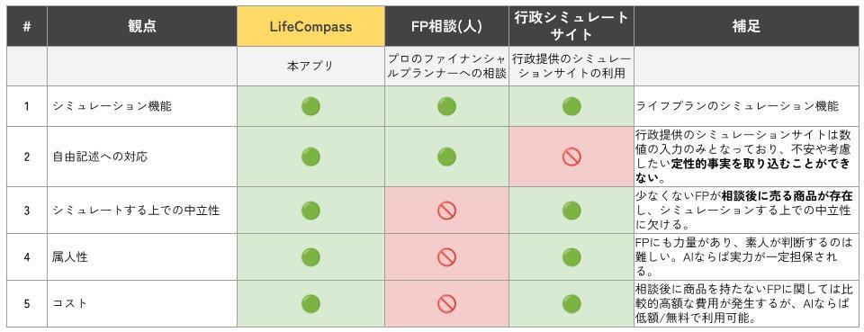
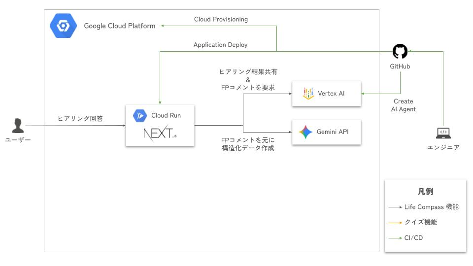

# Life Compass

> AI ファイナンシャルプランナーと対話しながら、家計や人生設計をシミュレーションできるアプリケーション

[第 4 回 Agentic AI Hackathon with Google Cloud](https://zenn.dev/hackathons/google-cloud-japan-ai-hackathon-vol4) 向けに開発されたプロダクトです。

## 概要

Life Compass は、**AI を活用したファイナンシャルプランニング支援アプリ**です。

従来のライフプランシミュレーションは数値入力のみで定性的な事情を考慮できず、プロの FP への相談はコストが高く中立性に課題がありました。Life Compass は複数の AI エージェントを組み合わせることで、**自由記述での対話**に対応しつつ、**中立的**かつ**低コスト**でライフプランのシミュレーションを実現します。

### 既存ソリューションとの比較



## アーキテクチャ



### マルチエージェントシステム

アプリケーションは 2 段階の AI エージェントパイプラインで構成されています。

1. **FP Instructor Agent**（Python / Vertex AI Agent Engine）
   - Gemini 2.5 Flash を使用
   - ファイナンシャルプランナーとして、ユーザーのヒアリング内容に対する指示・コメントを生成
2. **JSON Editor Agent**（TypeScript / Gemini API）
   - FP Agent の指示を受け取り、ヒアリングスキーマに基づいた構造化 JSON を生成・更新
   - Zod スキーマによるバリデーション

## 技術スタック

| レイヤー | 技術 |
| --- | --- |
| フロントエンド / バックエンド | Next.js 16 + React 19, TypeScript, Tailwind CSS 4 |
| 認証 | Firebase Authentication |
| AI | Google Gemini API, Vertex AI Agent Engine (ADK) |
| データベース | Firestore + PostgreSQL 15 (Cloud SQL) |
| AI エージェント | Python 3.11, UV, google-cloud-aiplatform |
| インフラ | GCP (Cloud Run, Vertex AI, Firestore, Cloud SQL), Terraform |

## ディレクトリ構成

```
.
├── app/                  # Next.js アプリケーション（フロントエンド + バックエンド）
│   ├── src/app/
│   │   ├── api/          # API エンドポイント
│   │   ├── agents/       # エージェントオーケストレーション
│   │   ├── components/   # UI コンポーネント
│   │   ├── schema/       # Zod バリデーションスキーマ
│   │   └── libs/         # Firebase / GCP 連携
│   └── docker-compose.yaml
├── ai/                   # Python AI エージェント
│   ├── agents/           # エージェント定義（FP Agent 等）
│   ├── deploy_agent.py   # デプロイスクリプト
│   └── pyproject.toml
├── cloud/                # Terraform インフラ定義
│   ├── main.tf
│   ├── cloudRun.tf
│   └── database.tf
└── docs/                 # ドキュメント・設計資料
```

## ローカル環境の構築

### 前提条件

- Node.js 24.x（[Volta](https://volta.sh/) 推奨）
- Python 3.11+
- [UV](https://docs.astral.sh/uv/)（Python パッケージマネージャー）
- Docker / Docker Compose
- [Google Cloud CLI](https://cloud.google.com/sdk/docs/install)

### 1. リポジトリのクローン

```bash
git clone https://github.com/<your-org>/Agentic-AI-Hackathon-Team-Brave.git
cd Agentic-AI-Hackathon-Team-Brave
```

### 2. GCP 認証

ローカルで Gemini API / Vertex AI を使用するために必要です。

```bash
gcloud auth application-default login
```

### 3. データベースの起動

PostgreSQL と Firestore エミュレータを Docker で起動します。

```bash
cd app
docker compose -p life-compass up --build -d
```

- PostgreSQL: `localhost:5432`
- Firestore エミュレータ UI: http://localhost:4000

### 4. 環境変数の設定

`app/.env.local` を作成し、以下の環境変数を設定してください。

```bash
###############
# GCP
###############
GCP_PROJECT_NUMBER=<your-gcp-project-number>

# Vertex AI（AI エージェント）
VERTEX_AGT_LOCATION=us-central1
VERTEX_AGT_RESOURCE_NAME=<your-vertex-agent-resource-name>

# Vertex AI（Gemini）
VERTEX_GEMINI_MODEL=gemini-2.5-flash
VERTEX_GEMINI_LOCATION=us-central1

# Firebase (frontend)
NEXT_PUBLIC_FIREBASE_API_KEY=<your-firebase-api-key>
NEXT_PUBLIC_FIREBASE_AUTH_DOMAIN=<your-project>.firebaseapp.com
NEXT_PUBLIC_FIREBASE_PROJECT_ID=<your-firebase-project-id>
NEXT_PUBLIC_FIREBASE_CLIENT_EMAIL=<your-firebase-client-email>
NEXT_PUBLIC_FIREBASE_APP_ID=<your-firebase-app-id>

# Firebase (backend)
FIREBASE_PROJECT_ID=<your-firebase-project-id>
FIREBASE_CLIENT_EMAIL=<your-firebase-client-email>
FIREBASE_PRIVATE_KEY=<your-firebase-private-key>

###############
# ローカル環境接続
###############
FIRESTORE_EMULATOR_HOST=localhost:8080
FIRESTORE_DATABASE_ID=life-compass
DATABASE_URL=postgresql://myuser:P@ssw0rd!@localhost:5432/life-compass-postgres
```

### 5. フロントエンド / バックエンドの起動

```bash
cd app
npm install
npm run dev
```

http://localhost:3000 でアクセスできます。

### 6. AI エージェントのセットアップ（任意）

AI エージェントの開発・デプロイを行う場合は以下を実行します。

> **注意:** パッケージマネージャーは `pip` ではなく `uv` を使用してください。

```bash
cd ai
uv sync                                        # 依存関係のインストール
uv run python deploy_agent.py fp_agent         # FP エージェントのデプロイ
uv run python test_agent.py                    # テスト実行
```

## 開発コマンド

### アプリケーション（app/）

```bash
npm run dev       # 開発サーバー起動
npm run build     # 本番ビルド
npm run lint      # ESLint 実行
npm run test      # テスト実行（Vitest）
```

### AI エージェント（ai/）

```bash
uv run ruff check .     # Lint
uv run ruff format .    # Format
uv run mypy .           # 型チェック
```

### インフラ（cloud/）

```bash
cd cloud
terraform init      # 初期化
terraform plan      # 変更確認
terraform apply     # 適用
```

## ライセンス

本プロジェクトは [MIT License](LICENSE) の下で公開されています。

### 使用している主な OSS とライセンス

| カテゴリ | 主要ライブラリ | ライセンス |
| --- | --- | --- |
| フレームワーク | Next.js, React | MIT |
| AI / GCP | google-cloud-aiplatform, google-genai, vertexai | Apache 2.0 |
| 認証 | Firebase, firebase-admin | Apache 2.0 |
| バリデーション | Zod | MIT |
| DB | Prisma, pg | Apache 2.0 / MIT |
| UI | Tailwind CSS, Radix UI, Recharts, Lucide | MIT |
| Python ツール | Ruff, MyPy | MIT |

依存パッケージの詳細なライセンス情報は `app/node_modules/*/LICENSE` および `ai/.venv/lib/*/LICENSE` を参照してください。
