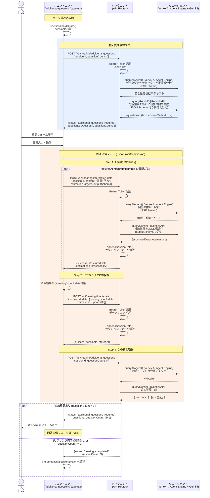

# hearing/additional-questions AI Agent Interaction Sequence Diagram

`hearing/additional-questions/page.tsx` におけるフロントエンド・バックエンド・AIエージェント間のインタラクションを示すシーケンス図。

## シーケンス図

## フロー概要

| ステップ | フロント | バックエンド | エージェント |
|---|---|---|---|
| **初回質問取得** | `useAdditionalQuestions()` で POST | 認証後ハンドラ呼び出し | Agent Engine: 整合性チェック → Gemini: 質問生成 |
| **AI解釈** (並列) | `processAiInterpretations()` で質問ごとにPOST | 認証後ハンドラ呼び出し | Agent Engine: 推論・解釈 → Gemini: JSON構造化 |
| **データ保存** | `processAndSaveAnswers()` でPOST | サニタイズ後セッション保存 | (なし) |
| **次の質問取得** | `fetchAdditionalQuestions()` で再POST | 同上 | Agent Engine + Gemini (同上) |
| **ループ終了** | `/life-compass` へ遷移 | `hearing_completed` 返却 | - |

## 主要ポイント

- **2段階エージェントパイプライン**: すべてのAI処理で Vertex AI Agent Engine（推論・文脈理解）→ Gemini API（JSON構造化）の順に呼び出し
- **Agent EngineはSSEストリーム**でレスポンスを返す
- **Gemini APIはJSON Schema付き構造化出力**で型安全なレスポンスを生成
- **最大3ラウンド**で追加質問ループが終了

## 関連ファイル

| ファイル | 役割 |
|---|---|
| `app/src/app/hearing/additional-questions/page.tsx` | ページコンポーネント |
| `app/src/app/hearing/additional-questions/hooks/useAdditionalQuestions.ts` | 追加質問取得フック |
| `app/src/app/hearing/additional-questions/hooks/useAnswerSubmission.ts` | 回答送信フック |
| `app/src/app/api/hearing/additional-questions/route.ts` | 追加質問APIルート |
| `app/src/app/api/hearing/interpreted-data/route.ts` | AI解釈APIルート |
| `app/src/app/api/hearing/direct-data/route.ts` | 直接データ保存APIルート |
| `app/src/libs/google/queryAIAgent.ts` | Vertex AI Agent Engine呼び出し |
| `app/src/libs/google/queryGemini.ts` | Gemini API呼び出し |
| `app/src/libs/google/sessionManager.ts` | セッション管理 |
